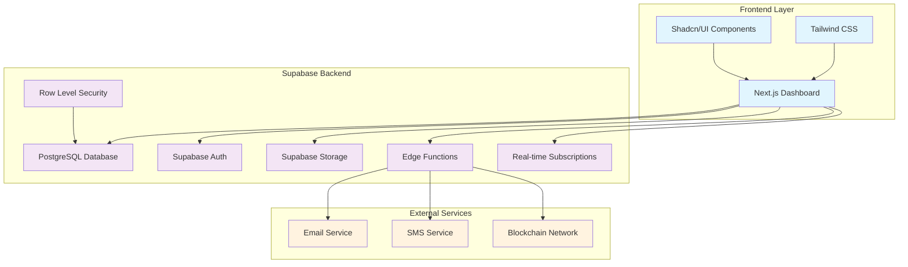

# Design Document

## Overview

The G1 Dashboard System is a comprehensive secure transaction command center built on Supabase that manages the complete lifecycle of Secure Keeper Receipts (SKRs), client relationships, financial documents, and compliance workflows. The system serves as the central hub for G1 Group Companies' high-value asset transactions, ensuring complete traceability, security, and regulatory compliance.

The architecture leverages Supabase's full-stack capabilities including PostgreSQL with Row Level Security (RLS), real-time subscriptions, Edge Functions for document generation, and Storage for secure file management. The frontend will be built using Next.js with Tailwind CSS and Shadcn/UI components for a modern, responsive dashboard experience.

## Architecture

### System Architecture Overview



### Technology Stack

- **Frontend Framework**: Next.js 14 with App Router
- **Styling**: Tailwind CSS with Shadcn/UI component library
- **Backend**: Supabase (PostgreSQL + Auth + Storage + Edge Functions)
- **Database**: PostgreSQL with pgvector for document search
- **Authentication**: Supabase Auth with Row Level Security
- **File Storage**: Supabase Storage with CDN
- **Document Generation**: Edge Functions with PDF generation libraries
- **Real-time Updates**: Supabase Realtime
- **Deployment**: Vercel (Frontend) + Supabase Platform

## Components and Interfaces

### Database Schema Design

#### Core Tables

**clients**
```sql
CREATE TABLE clients (
    id UUID PRIMARY KEY DEFAULT gen_random_uuid(),
    name TEXT NOT NULL,
    type TEXT NOT NULL CHECK (type IN ('individual', 'corporate', 'institutional')),
    email TEXT UNIQUE NOT NULL,
    phone TEXT,
    country TEXT NOT NULL,
    address JSONB,
    risk_level TEXT NOT NULL DEFAULT 'medium' CHECK (risk_level IN ('low', 'medium', 'high')),
    compliance_status TEXT NOT NULL DEFAULT 'pending' CHECK (compliance_status IN ('pending', 'approved', 'rejected', 'under_review')),
    kyc_documents JSONB DEFAULT '[]',
    created_at TIMESTAMPTZ DEFAULT NOW(),
    updated_at TIMESTAMPTZ DEFAULT NOW()
);
```

**assets**
```sql
CREATE TABLE assets (
    id UUID PRIMARY KEY DEFAULT gen_random_uuid(),
    client_id UUID REFERENCES clients(id) ON DELETE CASCADE,
    asset_name TEXT NOT NULL,
    asset_type TEXT NOT NULL,
    declared_value DECIMAL(15,2) NOT NULL,
    currency TEXT NOT NULL DEFAULT 'USD',
    origin TEXT NOT NULL,
    destination TEXT,
    specifications JSONB DEFAULT '{}',
    created_at TIMESTAMPTZ DEFAULT NOW(),
    updated_at TIMESTAMPTZ DEFAULT NOW()
);
```

**skrs**
```sql
CREATE TABLE skrs (
    id UUID PRIMARY KEY DEFAULT gen_random_uuid(),
    skr_number TEXT UNIQUE NOT NULL,
    client_id UUID REFERENCES clients(id) ON DELETE CASCADE,
    asset_id UUID REFERENCES assets(id) ON DELETE CASCADE,
    status TEXT NOT NULL DEFAULT 'draft' CHECK (status IN ('draft', 'approved', 'issued', 'in_transit', 'delivered', 'closed')),
    issue_date TIMESTAMPTZ,
    issued_by UUID REFERENCES auth.users(id),
    hash TEXT UNIQUE,
    pdf_url TEXT,
    qr_code_url TEXT,
    remarks TEXT,
    metadata JSONB DEFAULT '{}',
    created_at TIMESTAMPTZ DEFAULT NOW(),
    updated_at TIMESTAMPTZ DEFAULT NOW()
);
```

**tracking**
```sql
CREATE TABLE tracking (
    id UUID PRIMARY KEY DEFAULT gen_random_uuid(),
    skr_id UUID REFERENCES skrs(id) ON DELETE CASCADE,
    current_location TEXT,
    status TEXT NOT NULL,
    coordinates POINT,
    last_update TIMESTAMPTZ DEFAULT NOW(),
    updated_by UUID REFERENCES auth.users(id),
    notes TEXT,
    created_at TIMESTAMPTZ DEFAULT NOW()
);
```

**Financial Tables**
```sql
CREATE TABLE invoices (
    id UUID PRIMARY KEY DEFAULT gen_random_uuid(),
    invoice_number TEXT UNIQUE NOT NULL,
    client_id UUID REFERENCES clients(id) ON DELETE CASCADE,
    skr_id UUID REFERENCES skrs(id),
    amount DECIMAL(15,2) NOT NULL,
    currency TEXT NOT NULL DEFAULT 'USD',
    issue_date TIMESTAMPTZ DEFAULT NOW(),
    due_date TIMESTAMPTZ,
    pdf_url TEXT,
    status TEXT NOT NULL DEFAULT 'draft' CHECK (status IN ('draft', 'sent', 'paid', 'overdue', 'cancelled')),
    created_at TIMESTAMPTZ DEFAULT NOW(),
    updated_at TIMESTAMPTZ DEFAULT NOW()
);

CREATE TABLE receipts (
    id UUID PRIMARY KEY DEFAULT gen_random_uuid(),
    receipt_number TEXT UNIQUE NOT NULL,
    invoice_id UUID REFERENCES invoices(id) ON DELETE CASCADE,
    amount DECIMAL(15,2) NOT NULL,
    payment_method TEXT NOT NULL,
    payment_reference TEXT,
    issue_date TIMESTAMPTZ DEFAULT NOW(),
    pdf_url TEXT,
    created_at TIMESTAMPTZ DEFAULT NOW()
);

CREATE TABLE credit_notes (
    id UUID PRIMARY KEY DEFAULT gen_random_uuid(),
    credit_note_number TEXT UNIQUE NOT NULL,
    reference_invoice UUID REFERENCES invoices(id) ON DELETE CASCADE,
    amount DECIMAL(15,2) NOT NULL,
    reason TEXT NOT NULL,
    issue_date TIMESTAMPTZ DEFAULT NOW(),
    pdf_url TEXT,
    created_at TIMESTAMPTZ DEFAULT NOW()
);
```

**User Management**
```sql
CREATE TABLE user_profiles (
    id UUID PRIMARY KEY REFERENCES auth.users(id) ON DELETE CASCADE,
    name TEXT NOT NULL,
    role TEXT NOT NULL CHECK (role IN ('admin', 'finance', 'operations', 'compliance', 'read_only')),
    department TEXT,
    email TEXT NOT NULL,
    avatar_url TEXT,
    permissions JSONB DEFAULT '{}',
    status TEXT NOT NULL DEFAULT 'active' CHECK (status IN ('active', 'inactive', 'suspended')),
    created_at TIMESTAMPTZ DEFAULT NOW(),
    updated_at TIMESTAMPTZ DEFAULT NOW()
);
```

**Audit Logging**
```sql
CREATE TABLE audit_logs (
    id UUID PRIMARY KEY DEFAULT gen_random_uuid(),
    user_id UUID REFERENCES auth.users(id),
    action TEXT NOT NULL,
    resource_type TEXT NOT NULL,
    resource_id UUID,
    old_values JSONB,
    new_values JSONB,
    ip_address INET,
    user_agent TEXT,
    created_at TIMESTAMPTZ DEFAULT NOW()
);
```

### Row Level Security Policies

#### Client Access Policies
```sql
-- Clients table policies
ALTER TABLE clients ENABLE ROW LEVEL SECURITY;

CREATE POLICY "Users can view clients based on role" ON clients
    FOR SELECT USING (
        EXISTS (
            SELECT 1 FROM user_profiles 
            WHERE id = auth.uid() 
            AND role IN ('admin', 'finance', 'operations', 'compliance')
        )
    );

CREATE POLICY "Admin and Finance can manage clients" ON clients
    FOR ALL USING (
        EXISTS (
            SELECT 1 FROM user_profiles 
            WHERE id = auth.uid() 
            AND role IN ('admin', 'finance')
        )
    );
```

#### SKR Access Policies
```sql
-- SKRs table policies
ALTER TABLE skrs ENABLE ROW LEVEL SECURITY;

CREATE POLICY "Users can view SKRs based on role" ON skrs
    FOR SELECT USING (
        EXISTS (
            SELECT 1 FROM user_profiles 
            WHERE id = auth.uid() 
            AND role IN ('admin', 'finance', 'operations', 'compliance')
        )
    );

CREATE POLICY "Finance and Operations can create SKRs" ON skrs
    FOR INSERT WITH CHECK (
        EXISTS (
            SELECT 1 FROM user_profiles 
            WHERE id = auth.uid() 
            AND role IN ('admin', 'finance', 'operations')
        )
    );
```

### API Layer Design

#### REST API Endpoints

**SKR Management**
- `GET /api/skrs` - List SKRs with filtering and pagination
- `POST /api/skrs` - Create new SKR
- `GET /api/skrs/:id` - Get SKR details
- `PUT /api/skrs/:id` - Update SKR
- `POST /api/skrs/:id/approve` - Approve SKR
- `POST /api/skrs/:id/issue` - Issue SKR
- `GET /api/skrs/:id/verify` - Public verification endpoint

**Client Management**
- `GET /api/clients` - List clients
- `POST /api/clients` - Create client
- `GET /api/clients/:id` - Get client details
- `PUT /api/clients/:id` - Update client
- `GET /api/clients/:id/skrs` - Get client's SKRs

**Financial Operations**
- `GET /api/invoices` - List invoices
- `POST /api/invoices` - Create invoice
- `POST /api/receipts` - Create receipt
- `POST /api/credit-notes` - Create credit note

### Frontend Component Architecture

#### Page Structure
```
/dashboard
├── /skrs
│   ├── /create
│   ├── /[id]
│   └── /tracking
├── /clients
│   ├── /create
│   └── /[id]
├── /finance
│   ├── /invoices
│   ├── /receipts
│   └── /credit-notes
├── /compliance
├── /reports
└── /settings
```

#### Key Components

**SKRDashboard Component**
```typescript
interface SKRDashboardProps {
  skrs: SKR[]
  filters: FilterOptions
  onFilterChange: (filters: FilterOptions) => void
}

const SKRDashboard: React.FC<SKRDashboardProps> = ({
  skrs,
  filters,
  onFilterChange
}) => {
  // Real-time SKR updates
  // Filtering and search
  // Status visualization
  // Quick actions
}
```

**SKRForm Component**
```typescript
interface SKRFormProps {
  initialData?: Partial<SKR>
  onSubmit: (data: SKRFormData) => Promise<void>
  mode: 'create' | 'edit'
}

const SKRForm: React.FC<SKRFormProps> = ({
  initialData,
  onSubmit,
  mode
}) => {
  // Form validation with Zod
  // Client and asset selection
  // Document upload
  // Status management
}
```

## Data Models

### Core Data Models

#### SKR Model
```typescript
interface SKR {
  id: string
  skr_number: string
  client_id: string
  asset_id: string
  status: SKRStatus
  issue_date?: Date
  issued_by?: string
  hash?: string
  pdf_url?: string
  qr_code_url?: string
  remarks?: string
  metadata: Record<string, any>
  created_at: Date
  updated_at: Date
  
  // Relations
  client?: Client
  asset?: Asset
  tracking?: TrackingRecord[]
  invoices?: Invoice[]
}

type SKRStatus = 'draft' | 'approved' | 'issued' | 'in_transit' | 'delivered' | 'closed'
```

#### Client Model
```typescript
interface Client {
  id: string
  name: string
  type: 'individual' | 'corporate' | 'institutional'
  email: string
  phone?: string
  country: string
  address?: Address
  risk_level: 'low' | 'medium' | 'high'
  compliance_status: 'pending' | 'approved' | 'rejected' | 'under_review'
  kyc_documents: KYCDocument[]
  created_at: Date
  updated_at: Date
  
  // Relations
  assets?: Asset[]
  skrs?: SKR[]
  invoices?: Invoice[]
}

interface Address {
  street: string
  city: string
  state?: string
  postal_code: string
  country: string
}
```

#### Asset Model
```typescript
interface Asset {
  id: string
  client_id: string
  asset_name: string
  asset_type: string
  declared_value: number
  currency: string
  origin: string
  destination?: string
  specifications: Record<string, any>
  created_at: Date
  updated_at: Date
  
  // Relations
  client?: Client
  skrs?: SKR[]
}
```

### Document Generation Models

#### PDF Template Structure
```typescript
interface SKRPDFData {
  skr_number: string
  client: {
    name: string
    address: Address
  }
  asset: {
    name: string
    type: string
    value: number
    currency: string
  }
  issue_date: Date
  issued_by: string
  hash: string
  qr_code: string
  terms_conditions: string
}
```

## Error Handling

### Error Classification

#### Client Errors (4xx)
- **400 Bad Request**: Invalid input data, validation failures
- **401 Unauthorized**: Missing or invalid authentication
- **403 Forbidden**: Insufficient permissions for operation
- **404 Not Found**: Resource not found
- **409 Conflict**: Duplicate SKR numbers, constraint violations

#### Server Errors (5xx)
- **500 Internal Server Error**: Unexpected server errors
- **502 Bad Gateway**: External service failures
- **503 Service Unavailable**: Database or service downtime

### Error Response Format
```typescript
interface ErrorResponse {
  error: {
    code: string
    message: string
    details?: Record<string, any>
    timestamp: string
    request_id: string
  }
}
```

### Error Handling Strategies

#### Database Errors
- Connection failures: Retry with exponential backoff
- Constraint violations: Return specific validation errors
- Transaction failures: Rollback and retry

#### External Service Errors
- PDF generation failures: Queue for retry
- Email delivery failures: Log and retry with different provider
- Blockchain logging failures: Continue operation, log error

#### Frontend Error Handling
```typescript
const useErrorHandler = () => {
  const handleError = (error: Error) => {
    // Log error to monitoring service
    console.error('Application error:', error)
    
    // Show user-friendly message
    toast.error(getErrorMessage(error))
    
    // Report to error tracking service
    reportError(error)
  }
  
  return { handleError }
}
```

## Testing Strategy

### Testing Pyramid

#### Unit Tests (70%)
- **Database Functions**: Test all stored procedures and triggers
- **API Endpoints**: Test request/response handling and validation
- **Business Logic**: Test SKR generation, validation, and status transitions
- **Utility Functions**: Test PDF generation, hash creation, number formatting

#### Integration Tests (20%)
- **Database Integration**: Test RLS policies and complex queries
- **API Integration**: Test end-to-end API workflows
- **External Services**: Test PDF generation and email sending
- **Authentication Flow**: Test user login and permission checking

#### End-to-End Tests (10%)
- **SKR Lifecycle**: Test complete SKR creation to delivery workflow
- **User Workflows**: Test common user journeys through the dashboard
- **Cross-browser Testing**: Ensure compatibility across browsers
- **Mobile Responsiveness**: Test dashboard on mobile devices

### Test Data Management

#### Test Database Setup
```sql
-- Test data for development and testing
INSERT INTO clients (name, type, email, country, risk_level) VALUES
('Test Corp Ltd', 'corporate', 'test@testcorp.com', 'US', 'low'),
('John Doe', 'individual', 'john@example.com', 'UK', 'medium');

INSERT INTO assets (client_id, asset_name, asset_type, declared_value, origin) VALUES
((SELECT id FROM clients WHERE email = 'test@testcorp.com'), 'Gold Bars', 'Precious Metal', 1000000.00, 'London Vault');
```

#### Mock Services
- Mock PDF generation for faster tests
- Mock email services to avoid sending real emails
- Mock blockchain services for testing

### Performance Testing

#### Load Testing Scenarios
- **Concurrent SKR Creation**: Test system under high SKR creation load
- **Dashboard Performance**: Test dashboard with large datasets
- **PDF Generation**: Test bulk PDF generation performance
- **Database Queries**: Test complex reporting queries

#### Performance Metrics
- **Response Time**: API endpoints should respond within 200ms
- **Throughput**: System should handle 100 concurrent users
- **Database Performance**: Queries should execute within 50ms
- **PDF Generation**: Should complete within 5 seconds

## Security Considerations

### Authentication and Authorization

#### Multi-Factor Authentication
- TOTP-based 2FA for all admin users
- SMS backup for critical operations
- Hardware key support for high-privilege accounts

#### Session Management
- JWT tokens with short expiration (15 minutes)
- Refresh token rotation
- Session invalidation on suspicious activity

### Data Protection

#### Encryption at Rest
- Database encryption using Supabase's built-in encryption
- File encryption for stored PDFs and documents
- Encrypted backup storage

#### Encryption in Transit
- TLS 1.3 for all API communications
- Certificate pinning for mobile applications
- Encrypted WebSocket connections for real-time updates

### Input Validation and Sanitization

#### Server-side Validation
```typescript
const createSKRSchema = z.object({
  client_id: z.string().uuid(),
  asset_id: z.string().uuid(),
  remarks: z.string().max(1000).optional(),
  metadata: z.record(z.any()).optional()
})
```

#### SQL Injection Prevention
- Parameterized queries only
- Input sanitization for all user inputs
- Stored procedures for complex operations

### Audit and Compliance

#### Comprehensive Audit Logging
- All user actions logged with timestamps
- IP address and user agent tracking
- Data change tracking with before/after values
- Automated compliance reporting

#### Data Retention Policies
- SKR data retained for 7 years minimum
- Audit logs retained for 10 years
- Automated data archival processes
- Secure data deletion procedures

### Security Monitoring

#### Real-time Monitoring
- Failed login attempt detection
- Unusual access pattern alerts
- Data export monitoring
- Privilege escalation detection

#### Security Headers
```typescript
const securityHeaders = {
  'Content-Security-Policy': "default-src 'self'",
  'X-Frame-Options': 'DENY',
  'X-Content-Type-Options': 'nosniff',
  'Referrer-Policy': 'strict-origin-when-cross-origin',
  'Permissions-Policy': 'camera=(), microphone=(), geolocation=()'
}
```

This design provides a comprehensive foundation for building the G1 Dashboard System with security, scalability, and maintainability as core principles. The architecture leverages Supabase's capabilities while ensuring proper separation of concerns and robust error handling throughout the system.